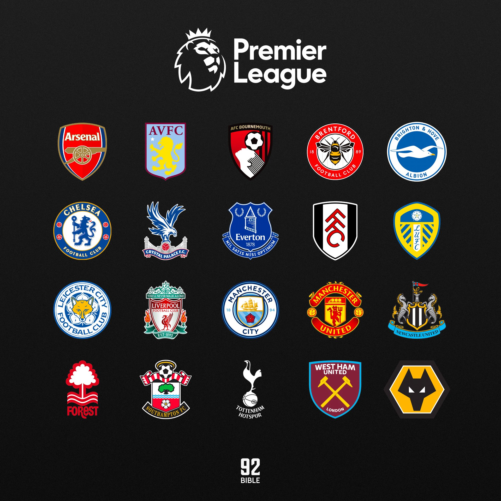

# Premier League Team Managment
## Project Description
For my project I would like to create a Premier League CRUD app for the 22/23 season. It aims to 
provide comprehensive football data, including player details, team information and match statistics. I will be using API-Football as my third-party API which will help fetch data to seed our database and potentially retrieve real-time data for certain features.

## Routes
'/api/players'
CRUD Operations:
-  Create: POST /api/players - Create a new player
-  Read: GET /api/players - Retrieve all players
-  Read: GET /api/players/:id - Retrieve a specific player
- Read: GET /api/players/team/:teamName - Retrieves all players by team name
- Read: GET /api/players/name/:name - Retrieves a single player by name
-  Update: PUT /api/players/:id - Update player information
-  Delete: DELETE /api/players/:id - Delete a player
-  Delete: DELETE /api/players/name/name: - Delete a player by name

'/api/teams'
CRUD Operations:
-  Create: POST /api/teams - Create a new team
-  Read: GET /api/teams - Retrieve all teams
-  Read: GET /api/teams/:id - Retrieve a specific team
-  Update: PUT /api/teams/:id - Update team information
-  Delete: DELETE /api/teams/:id - Delete a team

## Models
Player:
    name: String,
    age: Number,
    number: Number,
    position: String,
    team: {
        name: String
    }

Team:
team: {
        name: String,
    },
    venue: {
        name: String,
        city: String,
        capacity: Number,
    }

## MVP Goals
As an MVP (Most Viable Project), the Premier League Statsbomb app will aim to accomplish the following user stories:

1. As a user, I want to be able to view a list of players and teams
2. As a user, I want to be able to create new players and teams
3. As a user, I want to be able to update player and teams
4. As a user, I want to be able to delete players and teams.
## Stretch Goals
The following user stories can be considered as stretch goals to enhance the premier league statsbomb app

1. As a user, I want to be able to filter players and teams based on attributes like position, nationality, or date.
2. As a user, I want to see real-time match updates and statistics from API-Football.
3. As a user, I want to be able to authenticate and have personalized access to specific features.